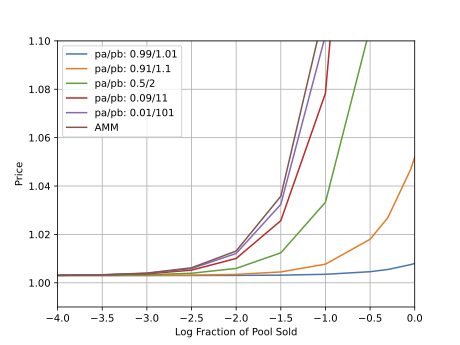

# Liquidity Efficient DEX on Cardano - Smart Contracts

This repository contains the smart contracts for our Liquidity Efficient DEX project.

## Table of Contents

- [Build Instructions](#build-instructions)
  - [OpShin Orderbook Build Instructions](#opshin-orderbook-build-instructions)
    - [Setup](#setup)
    - [Running the Tests](#running-the-tests)
    - [Compiling the Contracts](#compiling-the-contracts)
  - [Concentrated Liquidity Pools Build Instructions](#concentrated-liquidity-pools-build-instructions)
    - [Installation of Dependencies](#installation-of-dependencies)
    - [Compiling the Plutus Scripts](#compiling-the-plutus-scripts)
- [Preprod Testnet Transactions](#preprod-testnet-transactions)
- [Concentrated Hybrid Model (CHM) on Cardano DEX - Concept](#concentrated-hybrid-model-chm-on-cardano-dex---concept)
  - [Introduction](#introduction)
  - [Key Components](#key-components)
    - [On-Chain Orderbook](#on-chain-orderbook)
    - [On-Chain Market Making Models](#on-chain-market-making-models)
      - [Concentrated Liquidity Pools](#concentrated-liquidity-pools)
  - [Implementation Details](#implementation-details)
    - [Initialization](#initialization)
    - [Swaps](#swaps)
    - [Deposits and Withdrawals](#deposits-and-withdrawals)
  - [Advantages of CHM](#advantages-of-chm)
- [Concentrated Hybrid Model (CHM) on Cardano DEX - Implementation Details](#concentrated-hybrid-model-chm-on-cardano-dex---implementation-details)
  - [Add/Remove Liquidity](#addremove-liquidity)
  - [Trade a Specific Token](#trade-a-specific-token)
  - [Ensuring Pool Invariant](#ensuring-pool-invariant)
  - [Key Imports](#key-imports)
  - [Core Components](#core-components)
    - [mkPoolScript](#mkpoolscript)
    - [poolScript](#poolscript)
    - [mkPoolValidator](#mkpoolvalidator)
  - [Validation Functions](#validation-functions)
    - [validateDirectSwap](#validatedirectswap)
    - [validateApplyPool](#validateapplypool)
  - [Helper Functions](#helper-functions)
    - [applyStep](#applystep)
    - [validateDeposit](#validatedeposit)
    - [validateWithdraw](#validatewithdraw)
- [Concentrated Hybrid Model (CHM) on Cardano DEX - Performance Research](#concentrated-hybrid-model-chm-on-cardano-dex---performance-research)

## Build instructions

Contracts for the `onchain/orderbook` part, and the `onchain/concentrated-lp` part of the repository have to be built seperately. In the following, we give detailed instructions for each.

### OpShin Orderbook build instructions

#### Setup

1. Install Python 3.8, 3.9 or 3.10.

2. Ensure `python3 --version` works in your command line. Open a Terminal in the browser VSCode interface (F1 -> Terminal: Create New Terminal)
In Windows, you can do this by copying the `python.exe` file to `python3.exe` in your `PATH` environment variable.

3. Install python poetry.

On demeter.run or Linux/Ubuntu run 
```bash
curl -sSL https://install.python-poetry.org | python3 -
echo 'export PATH=/config/.local/bin:$PATH' >> ~/.bashrc
bash
```

Otherwise, follow the official documentation [here](https://python-poetry.org/docs/#installation).

4. Install a python virtual environment with poetry:
```bash
# install python dependencies
poetry install
# run a shell with the virtual environment activated
poetry shell
```

#### Running the tests

To run all the tests, simply do

```bash
pytest tests
```

#### Compiling the contracts

Compilation requires being inside the shell and having set up the [plutonomy-cli](https://github.com/OpShin/plutonomy-cli) in the `PATH`.

To compile all contracts, simply run the following command.

```bash
python3 scripts/build.py
```

This compiles and compresses (using the plutonomy-cli) all contracts.

### Concentrated Liquidity Pools build instructions

Now, we switch to the `onchain/concentrated-lp` part of the repository.

#### Installation of Dependencies

Before diving into the smart contract, ensure you have the necessary dependencies installed. Here's a guide on how to manually install the required Cardano and Haskell dependencies:

1. **Libsodium** - a modern, easy-to-use software library for encryption, decryption, signatures, password hashing, and more.
   
```sh
git clone https://github.com/input-output-hk/libsodium
cd libsodium
git checkout 66f017f1
./autogen.sh
./configure
make
sudo make install
```

```sh
export LD_LIBRARY_PATH="/usr/local/lib:$LD_LIBRARY_PATH"
export PKG_CONFIG_PATH="/usr/local/lib/pkgconfig:$PKG_CONFIG_PATH"
```

2. Bitcoin Core Secp256k1 - a library for optimized ECDSA signature verification, a crucial component for blockchain applications.

```sh
git clone https://github.com/bitcoin-core/secp256k1
cd secp256k1
git checkout ac83be33
./autogen.sh
./configure --enable-module-schnorrsig --enable-experimental
make
make check
sudo make install
```

3. Supranational BLST - a library for BLS Signatures, a cryptographic primitive used for validating transactions on many blockchain platforms.

```sh
git clone https://github.com/supranational/blst
cd blst
./build.sh
sudo cp libblst.a /usr/local/lib/
```

```sh
echo 'prefix=/usr/local/lib
libdir=${prefix}
includedir=${prefix}

Name: libblst
Description: The BLST library
Version: 0.3.11  # adjust this to the correct version
Libs: -L${libdir} -lblst
Cflags: -I${includedir}' | sudo tee /usr/local/lib/pkgconfig/libblst.pc
```

```sh
sudo mv /path/to/blst/bindings/blst.h /usr/local/include/
sudo mv /path/to/blst/bindings/blst_aux.h /usr/local/include/
```

Each of these libraries is crucial for working with Cardano smart contracts and the Haskell programming environment. Ensure that you have properly installed and configured them before proceeding.

#### Compiling the Plutus Scripts

To compile the validator script, use the following command from the workspace terminal. This command triggers the serialization process defined in `Main.hs` and generates `.plutus`, `.addr`, and `_policyid` files in the `plutus` directory and `testnet` subdirectory.

```sh
cabal run concentrated-liquidity-pools
./build-scripts.sh
```

## Preprod Testnet Transactions

This section provides a summary of key transactions on the preprod testnet for the Liquidity Efficient DEX project.

- **CLP Creation**: [View Transaction](https://preprod.cardanoscan.io/transaction/3a377a69f345dfd84f4635069da6ca13a7543b988e85d422dfe71e567991b915)

  This transaction marks the creation of a Concentrated Liquidity Pool (CLP) on the preprod testnet. CLPs allow liquidity providers to allocate assets within specific price ranges, optimizing capital efficiency.

- **CLP Liquidity Deposit Request**: [View Transaction](https://preprod.cardanoscan.io/transaction/3a5a798555697a7b0332ffd72b66b5c19cc123df81b0817788444cbec201300f)

  This transaction represents a liquidity provider's request to deposit assets into a Concentrated Liquidity Pool (CLP) on the preprod testnet. The deposit increases liquidity within the pool, supporting trading activities.

- **CLP Batching of Deposit**: [View Transaction](https://preprod.cardanoscan.io/transaction/50699f1a369f1008864ac420c79028d82e4a73728d33d54055b9a58ba37f1307)

  This transaction demonstrates the batching process for depositing assets into a Concentrated Liquidity Pool (CLP) on the preprod testnet. Batching allows multiple deposits to be processed efficiently, optimizing gas fees and transaction throughput.

- **OpShin Orderbook Place Order**: [View Transaction](https://preprod.cardanoscan.io/transaction/222a8e3511fa81351791d85ade5cda06469d6e3219782db40047726d1065458e)

  This transaction records the placement of an order on the OpShin Orderbook on the preprod testnet. The OpShin Orderbook facilitates decentralized and transparent trade execution by matching buy and sell orders.

- **OpShin Orderbook Fill Order**: [View Transaction](https://preprod.cardanoscan.io/transaction/eec497f8cea6e361031f94f1adda8098ac2cf82320efe9d58f995ab8cfcd4af6)

  This transaction captures the fulfillment of an order on the OpShin Orderbook on the preprod testnet. It demonstrates the execution of a trade where a buy order is matched with a corresponding sell order, ensuring efficient market liquidity.

These transactions showcase the functionality and operational flow of the Liquidity Efficient DEX smart contracts on the preprod testnet environment.

## Concentrated Hybrid Model (CHM) on Cardano DEX - Concept

### Introduction

The Concentrated Hybrid Model (CHM) is an advanced liquidity provision and decentralized exchange (DEX) architecture designed specifically for the Cardano blockchain. It addresses inefficiencies in liquidity utilization and impermanent loss while leveraging Cardano’s extended UTXO (eUTXO) model to enhance transaction throughput and efficiency.

### Key Components

#### On-Chain Orderbook

- **Description**: The on-chain orderbook records all trading requests from users, ensuring decentralized and transparent trade execution.
- **Order Fulfillment Methods**:
  1. **Matching Orders within the Orderbook**: Directly match buy and sell orders with complementary price points.
  2. **Using On-Chain Market Makers**: Engage with on-chain automated market makers (AMMs) to facilitate trades.
  3. **Using Own Funds**: DEX bots can use their own funds to fulfill orders when no direct match or suitable AMM is available.

#### On-Chain Market Making Models

- **Concentrated Liquidity Pools**:
  - **Price Range Specification**: Liquidity providers can allocate assets within specific price ranges, increasing capital efficiency.
  - **Mathematical Model**:
    - **Liquidity Calculation**:
       ```math
      L = \frac{B + \sqrt{B^2 + 4xyA}}{2A}
      ```
      where
      ```math
      A = 1 - \frac{\sqrt{p_a}}{\sqrt{p_b}}
      ```
       and
      ```math
      B = \frac{y}{\sqrt{p_b}} + x\sqrt{p_a}
      ```.
    - **Price Determination**:
      ```math
      \sqrt{P} = \frac{y_{\text{virt}}}{L} = \frac{y}{L} + \sqrt{p_a}
      ```
  - **Advantages**: Allows for the creation of multiple pools with varying tick sizes and overlapping price ranges, facilitating parallel order matching and enhanced liquidity utilization. Similar to concepts introduced in the UniSwap v3 whitepaper. 

### Implementation Details

#### Initialization

- **Pool Creation**: Define initial liquidity and price range parameters. Ensure sufficient token amounts to match desired liquidity using the formula for liquidity calculation.

#### Swaps

- **Liquidity Maintenance**: Ensure post-swap liquidity```math L' ``` is greater than or equal to pre-swap liquidity ```math L ```. Apply liquidity provider fees as per the Uniswap v1 approach.

#### Deposits and Withdrawals

- **Deposit**:
  - Calculate maximum token amounts that can be added based on the current ratio.
  - Compute new liquidity and mint corresponding LP tokens using:
    ```math
    \Delta l = l \frac{\Delta L}{L}
    ```
- **Withdrawal**:
  - Calculate token amounts to be given to the user based on the number of LP tokens burned.
  - Use:
    ```math
    \Delta x = \Delta L \left(\frac{1}{\sqrt{P}}-\frac{1}{\sqrt{p_b}}\right)
    ```
    ```math
    \Delta y = \Delta L \left(\sqrt{P}-\sqrt{p_a}\right)
    ```

### Advantages of CHM

1. **Increased Capital Efficiency**: Optimized use of liquidity through concentrated pools.
2. **Reduced Impermanent Loss**: Minimized risk by allowing LPs to specify price ranges.
3. **Customizable Risk Management**: Flexibility for LPs to manage their exposure strategically.
4. **Cardano Optimization**: Enhanced performance and user experience tailored for the eUTXO model.
5. **Enhanced User Experience**: Intuitive and efficient liquidity provision attracting diverse LPs.

## Concentrated Hybrid Model (CHM) on Cardano DEX - Implementation Details
We differ between different requests

1. Add/Remove Liquidity - done through a batching script specfically made for the concentrated liquidity pools
2. Trade a specific token - request made throught the on-chain orderbook. The off-chain matchmakers will match these orders partially/fully against the open orders in the orderbook

In addition, we now put a specific focus on the concentrated pool scripts to compute that the pool invariant is fulfilled at all times:

## Concentrated Hybrid Model (CHM) on Cardano DEX - Implementation Details

We handle different types of requests as follows:

1. **Add/Remove Liquidity**: This is managed through a batching script specifically designed for the concentrated liquidity pools.
2. **Trade a Specific Token**: Requests are made via the on-chain order book. Off-chain matchmakers then partially or fully match these orders against open orders in the order book.

We focus on ensuring that the pool invariant is consistently maintained through concentrated pool scripts.

### Key Imports

- `Data.Bool`: Provides Boolean operations.
- `Plutus.V2.Ledger.Contexts`: Contains types and functions for transaction contexts.
- `MuesliSwapPools.*`: Imports various utility functions and types specific to the MuesliSwapPools DEX.

## Core Components

### `mkPoolScript`

The `mkPoolScript` function creates the pool script for the DEX using the Plutonomy library to optimize the script.

### `poolScript`

The `poolScript` function defines the validator script for the pool by compiling the `mkPoolValidator` function with specific pool parameters.

### `mkPoolValidator`

The `mkPoolValidator` function contains the main validation logic for the pool. It handles different types of redeemers to either apply a pool operation or perform a direct swap.

## Validation Functions

### `validateDirectSwap`

This function ensures the conditions for direct swap operations are met, such as maintaining pool value, verifying NFT tokens, and preventing the minting of new assets.

### `validateApplyPool`

This function validates pool operations by ensuring orders are correctly applied and the pool state is accurately updated.

## Helper Functions

### `applyStep`

This function validates individual orders and updates the pool state accordingly.

### `validateDeposit`

This function ensures deposits are valid and that LP tokens are correctly minted in exchange for deposited assets.

### `validateWithdraw`

This function ensures withdrawals are valid and that assets are correctly returned to liquidity providers in exchange for LP tokens.

##  Concentrated Hybrid Model (CHM) on Cardano DEX - Performance Research

We aim quantify the effect that narrowing the price range of a concentrated liquidity pool has on the competitiveness of the quotes it can produce.

For all experiments, pools were created with real buy and sell reserves of $10^{10}$ units and a fee of 0.3%. The reserve sizes were chosen as they are on the same order of magnitude as the reserves in the DJED/ADA concentrated liquidity pool listed on MuesliSwap. In this setting, the fair price is 1 and the minimum possible price (considering the pool fee) is 1.003. As a result of being instantiated with equal reserves, each pool sits perfectly in the middle of its price range. Note that throughout this document, the terms buy and sell are used from the perspective of the pool unless stated otherwise.

Table 1 shows that for relatively small trades (as a fraction of the real pool reserves), the pool price range has no effect on the amount a pool buys from the user for a fixed amount that it sells. For very small trades, as in the first row of the table, the best price cannot be reached due to the fee. This is the same for all pools, including the standard constant product pool. Even for larger trades, up to 0.001% of the real pool liquidity, all pools provide almost exactly the same offer (purchasing 100301 or 100302 of one token and selling 100000 of the other). For larger trade sizes, the discrepancies begin to grow. The final row shows that for a fixed purchase of size 0.1% of the real pool liquidity ($10^{7}$ in this case), the user would have to pay nearly 9000 more tokens to the pool with range 0.01/101 than to the pool with range 0.99/1.01.

**Table 1: Buy quotes offered by a range of concentrated liquidity pools, for fixed trade sizes.**

| Sell Amount | Fraction of Pool | 0.99/1.01 | 0.91/1.1 | 0.5/2 | 0.09/11 | 0.01/101 | AMM |
|-------------|------------------|-----------|----------|-------|---------|----------|-----|
| 100         | 1e-8             | 101       | 101      | 101   | 101     | 101      | 101 |
| 100000      | 1e-5             | 100301    | 100301   | 100302| 100302  | 100302   | 100302|
| 1000000     | 1e-4             | 1003010   | 1003014  | 1003039| 1003080| 1003100  | 1003110|
| 10000000    | 0.001            | 10030141  | 10030558 | 10033029| 10037102| 10039131 | 10040131|

Table 2 shows the same trends for trades from the opposite perspective. The table here represents the situation where a user sells a fixed quantity of tokens to a range of pools and compares the amount of tokens they receive back from each. As in Table 1 above, for trades up to 0.01% of the real pool liquidity the user notices no difference between any of the pools. To ground the comparison, the final row can be viewed as modelling a scenario in which the user trades 10 ADA with each of a range of liquidity pools with real reserves of 10000 ADA and 10000 TokenB. In this case, the user will receive back 0.008893 more TokenB from the pool with price range 0.99/1.01 than from the pool with range 0.01/101.

**Table 2: Sell quotes offered by a range of concentrated liquidity pools, for fixed trade sizes.**

| Buy Amount  | Fraction of Pool | 0.99/1.01 | 0.91/1.1 | 0.5/2 | 0.09/11 | 0.01/101 | AMM |
|-------------|------------------|-----------|----------|-------|---------|----------|-----|
| 100         | 1e-8             | 99        | 99       | 99    | 99      | 99       | 99  |
| 100000      | 1e-5             | 99699     | 99699    | 99699 | 99699   | 99699    | 99699|
| 1000000     | 1e-4             | 996999    | 996995   | 996970| 996930  | 996910   | 996900|
| 10000000    | 0.001            | 9969950   | 9969537  | 9967089| 9963061| 9961057  | 9960069|

As the behavior of the pools varies depending on the ratio between the size of the trade and the real pool liquidity, it is more instructive to consider price rather than absolute buy and sell amounts. Price is defined here as:

$$
\text{price}=\frac{\text{amount pool buys}}{\text{amount pool sells}}=\frac{\text{amount user sells}}{\text{amount user buys}}
$$

Therefore, higher prices are less competitive in this context.



Figure 1 shows how price changes for the different concentrated liquidity pools as a function of the relative trade size. For small trade sizes (below 0.01% of the real pool liquidity) there is no meaningful difference in price between any of the concentrated liquidity pools or even the constant product pool. The prices begin to diverge when trade volumes reach 0.1% of the real pool liquidity. At this size, the actual prices offered by the pools range from 1.003 to 1.004. This range corresponds to the data in the final row of Table 1. At 1% of pool liquidity, the prices range from 1.00306 for the pool with range 0.99/1.01 up to 1.012 for the pool with range 0.01/101. Above this, the prices diverge significantly as they approach their asymptotic limit for each pool.

These findings show that the real pool liquidity for any liquidity pool need only be 1000 times greater than the largest expected trade size. If the pool is this size, you can expect that even for relatively large trades the price will stay competitive (that is, near the lowest possible price given the pool fee). If the price range is very narrow, less capital can be used. For example, the pool with range 0.99/1.01 shows competitive pricing even for trades close to 100% of real liquidity. Therefore, the pool reserves need only be around twice as large as the largest expected trade size.

The findings also show that for trade volumes that are small relative to the real liquidity (that is, for trades with size less than 0.1% of the real liquidity), the price range of the pool does not impact the competitiveness of the pool quotes. In fact, concentrated liquidity pools behave the same as constant product pools for small trade sizes.
